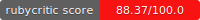

# EncodedId and EncodedId::Rails




`encoded_id` lets you encode numerical or hex IDs into obfuscated strings that can be used in URLs. 

`encoded_id-rails` is a Rails integration that provides additional features for using `encoded_id` with ActiveRecord models.

It's one of the most, if not _the_ most, feature complete gem of its kind!

👉 **Full documentation available at [encoded-id.onrender.com](https://encoded-id.onrender.com)**

## Key Features

* 🔄 **Reversible** - Encoded IDs can be decoded back to the original values
* 👥 **Multiple IDs** - Encode multiple numeric IDs in one string
* 🚀 **Choose your encoding** - Supports `Sqids` (default) and `Hashids`, or use your own custom encoder
* 👓 **Human-readable** - Character grouping & character mappings of easily confused characters for better readability
* 🔡 **Custom alphabets** - Use your preferred character set, or a provided default
* 🚗 **Performance** - Uses an optimized `Hashids` encoder (compared to `hashids` gem) for better performance and less memory usage, and have pushed performance improvements to `Sqids` as well
* 🤬 **Blocklist filtering** - Built-in word blocklist support with configurable modes and optional default lists

### Rails Integration Features

* 🏷️ **ActiveRecord integration** - Use with ActiveRecord models
* 🔑 **Per-model configuration** - Use custom salt and encoding settings per model
* 💅 **Slugged IDs** - URL-friendly slugs like `my-product--p5w9-z27j`
* 🔖 **Annotated IDs** - Model type indicators like `user_p5w9-z27j` (default behavior)
* 🔍 **Finder methods** - `find_by_encoded_id`, `find_by_encoded_id!`, `find_all_by_encoded_id`, `where_encoded_id`
* 🛣️ **URL params** - `to_param` automatically uses encoded IDs
* 🔒 **Safe defaults** - Limits on encoded ID lengths to prevent CPU and memory-intensive encode/decodes when used in URLs
* 💾 **Persistence** - Optional database persistence for efficient lookups


## Quick Example

```ruby
# Using Hashids encoder (requires salt)
coder = ::EncodedId::ReversibleId.hashid(salt: "my-salt")
coder.encode(123)
# => "m3pm-8anj"

# The encoded strings are reversible
coder.decode("m3pm-8anj")
# => [123]

# Supports encoding multiple IDs at once
coder.encode([78, 45])
# => "ny9y-sd7p"

# Using Sqids encoder (default, no salt required)
sqids_coder = ::EncodedId::ReversibleId.sqids
sqids_coder.encode(123)
# => (encoded value varies)

# Can also be used with ActiveRecord models
class User < ApplicationRecord
  include EncodedId::Rails::Model

  # Optional: define method to provide slug for encoded ID
  def name_for_encoded_id_slug
    full_name
  end
end

# Find by encoded ID
user = User.find_by_encoded_id("p5w9-z27j") # => #<User id: 78>
user.encoded_id                             # => "user_p5w9-z27j"
user.slugged_encoded_id                     # => "bob-smith--user_p5w9-z27j"
```

## Standalone Gem


```bash
# Add to Gemfile
bundle add encoded_id

# Or install directly
gem install encoded_id
```

See the [EncodedId API](https://encoded-id.onrender.com/docs/encoded_id/api) documentation for more details.

## Rails Integration Gem

```bash
# Add to Gemfile
bundle add encoded_id-rails

# Then run the generator
rails g encoded_id:rails:install
```

See the [Rails Integration](https://encoded-id.onrender.com/docs/encoded_id_rails) documentation for more details.

## Security Note

**Encoded IDs are not secure**. They are meant to provide obfuscation, not encryption. Do not use them as a security mechanism.

As of version 1.0.0, `Sqids` is the default encoder. `Hashids` is still supported but is officially deprecated by the Hashids project in favor of Sqids.

Read more about the security implications: [Hashids expose salt value](https://www.sjoerdlangkemper.nl/2023/11/25/hashids-expose-salt-value/) (note: this specifically applies to Hashids encoder)

## Compare to Alternate Gems

- [prefixed_ids](https://github.com/excid3/prefixed_ids)
- [obfuscate_id](https://github.com/namick/obfuscate_id)
- [friendly_id](https://github.com/norman/friendly_id)
- [with_uid](https://github.com/SPBTV/with_uid)
- [bullet_train-obfuscates_id](https://github.com/bullet-train-co/bullet_train-core/blob/main/bullet_train-obfuscates_id/app/models/concerns/obfuscates_id.rb)

For a detailed comparison, see the [Compared to Other Gems](https://encoded-id.onrender.com/docs/similar-gems/) documentation page.

## Documentation

Visit [encoded-id.onrender.com](https://encoded-id.onrender.com) for comprehensive documentation including:

- [EncodedId Core Guide](https://encoded-id.onrender.com/docs/encoded_id/) - Installation, configuration, examples, and advanced topics
- [EncodedId Rails Guide](https://encoded-id.onrender.com/docs/encoded_id_rails/) - Rails integration, configuration, and examples
- [EncodedId Core API Reference](https://encoded-id.onrender.com/docs/encoded_id/api)
- [Rails Integration API Reference](https://encoded-id.onrender.com/docs/encoded_id_rails/api)

## Development

After checking out the repo, run `bin/setup` to install dependencies. Run `bundle exec rake test` to run the tests.

Run benchmarks with `bin/benchmark <type>` where type is one of: `ips`, `memory`, `comparison`, `profile`, `flamegraph`, or `stress_decode`.

### Documentation

Run `bundle exec rake website:build` to build or `bundle exec rake website:serve` to preview locally.

## Contributing

Bug reports and pull requests are welcome on GitHub at https://github.com/stevegeek/encoded_id.

## License

The gem is available as open source under the terms of the [MIT License](https://opensource.org/licenses/MIT).